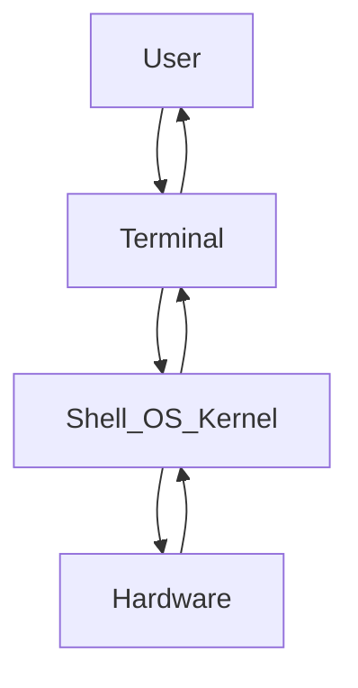

# lin-lin-linux

### Communicating with the Linux System

### Paths in a linux file System

- Special Paths
    1. `~` Home directory
    2. `/` Root directory
    3. `..` Parent of current directory
    4. `.` Current directory

### Where are the files saved when created in a WSL Terminal Window?

If you are also a user like me who is practicing Ubuntu on WSl, and in search of the files that you created in the terminal, you landed the right place. [Reference Link](https://askubuntu.com/questions/1194395/where-are-files-saved-when-created-in-a-wsl-terminal-window)

1. Open your 📁**File Explorer** Window
2. At the top, type: `\\wsl$\Ubuntu\home` - This is your home directory where you can view different folders. For me, I saved my created files at the `\\wsl$\Ubuntu\media`. Make sure to check it for you.
